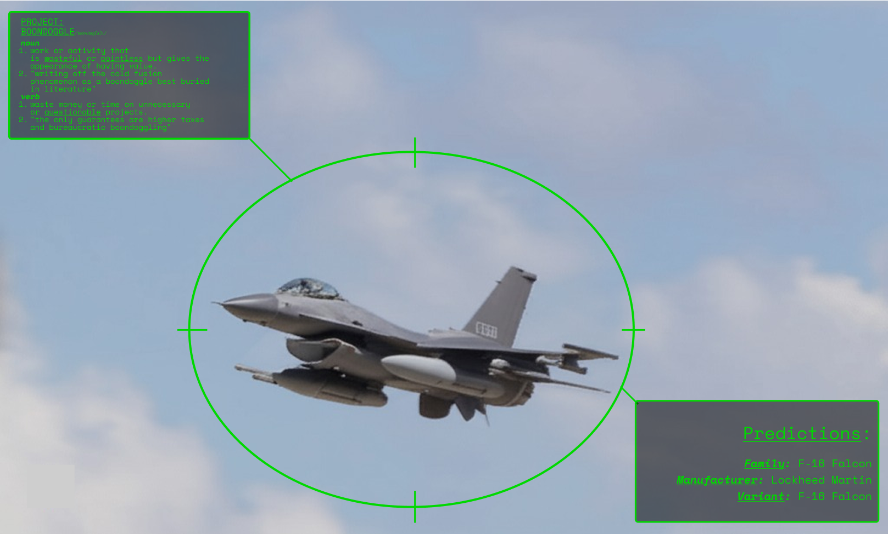

# Aircraft Identification Mixture of Experts (MoE) ML Model

## Authors: Johannes von Streuselberg and Grok

The goal of this repo is to demonstrate how to train a machine learning model and open source the weights generated by
training on the
Fine Grained Visual Classification Aircraft (herein FGVCA or FGVA) Dataset.

# Dataset

You can find the dataset here on [kaggle](https://www.kaggle.com/datasets/seryouxblaster764/fgvc-aircraft)

# The Model

This model is a mixture of experts model. It will predict the family, manufacturer, and variant
for a given image of an aircraft. It is not good at identifying images with multiple vehicles,
this is an area where improvements can and should be made. Feel free to make them!

# Getting Started

NOTE: We will assume you are at the root of the repository for all commands referenced below.

If you want to train your own model, follow the steps below for setup and training.

If you want to use the model that I have already trained, extract it from the zip archive in
this directory and remove 'bak.' from the filename.

## Setup

This assumes that you have python3 installed and a CUDA capable machine. It will still work if you do not have a device
capable of using the CUDA libraries, however it will use CPU and therefore be much more time intensive.

a. download the dataset (see [Where to find the dataset](#Dataset))
b. download dependencies `pip install -r requirements.txt`
c. point Config.DATA_DIR to the directory where you've stored the dataset
d. any additional configurations you might wish/need to make.

## Configuration

The [Config File](./fgvc_config.py) has the primary settings used for this project. This config is used by
the different processes, so you can be guaranteed that they will be available. However, any changes you may make
to the config at runtime will not persist unless you make that change to the aforementioned file itself.

## Training

a. Run training. `python train.py`

the script will output the result of the epochs. It can take some time for the first result to display, depending on the
hardware you're
using. It defaults to 20 epochs (training runs/batches) but you can continue training for as long as you find the
accuracies are increasing
at an order you find suitable.

## Export (to ONNX)

If you are happy with the training results of the model, you can set `EXPORT_MODEL_TO_ONNX` to `True` in
the [config file](#Configuration)

a. Run export `python export.py`

## Inference

f. Run inference `python inference.py path/to/img`

### To The Curious

Yes, this was mostly vibe-coded with grok; however, the state of this repo is after significant de-duplication and
refactoring to produce
a suite of scripts that would allow one to serve inferences about the family, manufacturer, and variant of a given
aircraft in an image. 

Further enhancements have added centralized configuration for various datapoints and functions to prevent 
duplication of code.

# License

Software is provided under the MIT License, see LICENSE file for more information.

Thanks!
